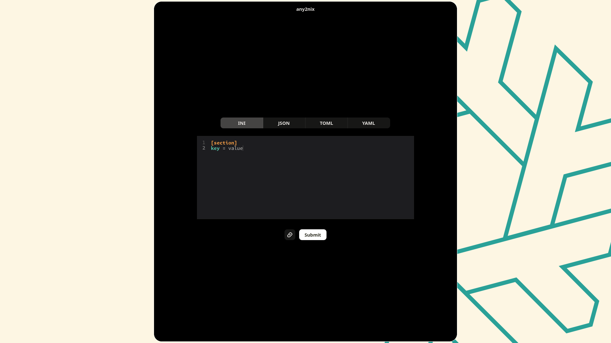

<!--
SPDX-FileCopyrightText: 2026 Gabriel Santos de Souza <gabriel.santosdesouza@dcomp.ufs.br>

SPDX-License-Identifier: CC-BY-4.0
-->

# [any2nix-gui: Nix Converter GUI](https://docs.rs/any2nix-gui)

## Introduction

any2nix-gui is a graphical user interface (GUI) used to convert data in other formats to [Nix](https://nixos.org/).
