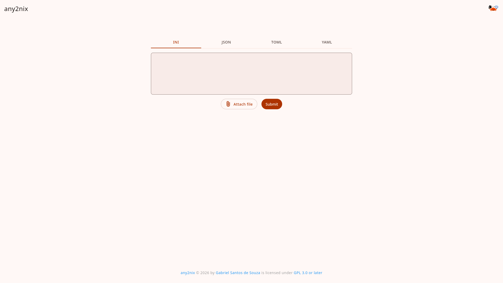

<!--
SPDX-FileCopyrightText: 2026 Gabriel Santos de Souza <gabriel.santosdesouza@dcomp.ufs.br>

SPDX-License-Identifier: CC-BY-4.0
-->


# [any2nix-website: Nix Converter Website](https://docs.rs/any2nix-website)

[](LICENSE)



## Introduction

any2nix-website is a web application used to translate from various formats to [Nix](https://nixos.org/).

## Building

This crate bundles frontend assets using [Bun](https://bun.sh/) before embedding them into the Rust application:

```bash
# Install dependencies and build bundled assets.
bun run build

# Build the crate
cargo build
```

When building through Nix (`nix build .#any2nix-website`), dependencies and bundled assets are handled automatically during the build phase.
